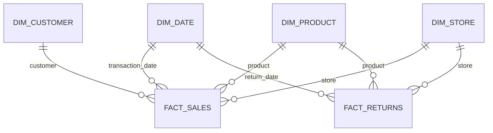

# Data Modeling

<div dir="rtl" align="right">

**مرحله:** ۵ — طراحی مدل داده برای Power BI  
**وضعیت:** تکمیل‌شده  
**ابزار:** Python، Pandas، Power BI و SQL Server

در این مرحله فایل‌های پاک‌سازی‌شده به یک مدل ستاره‌ای تبدیل شدند. هدف این بود که مدل برای ساخت Measureهای DAX ساده باشد، رابطه‌های مبهم ایجاد نکند و بتوان فروش و مرجوعی را با ابعاد مشترک مقایسه کرد.

## Normalization در این پروژه چه معنی دارد؟

در این پروژه منظور اصلی از Normalization، **سامان‌دهی ساختار داده برای تحلیل** است؛ نه تبدیل مقدارهای عددی به بازه صفر تا یک و نه Standardization آماری.

قیمت، هزینه، تعداد فروش و مساحت فروشگاه با واحد واقعی خود در داشبورد استفاده می‌شوند. مقیاس‌بندی این ستون‌ها برای KPIهای Business Intelligence لازم نیست و تفسیر مدیریتی را دشوارتر می‌کند.

## مدل انتخاب‌شده

مدل نهایی شامل دو Fact و چهار Dimension است:

- `fact_sales`
- `fact_returns`
- `dim_date`
- `dim_customer`
- `dim_product`
- `dim_store`



رابطه دوم `dim_date` با `fact_sales[stock_date_key]` در Power BI به‌صورت **Inactive** ساخته می‌شود. رابطه فعال همان `transaction_date_key` است.

## Grain هر جدول

| جدول | Grain | کلید اصلی |
|---|---|---|
| `dim_date` | یک ردیف برای هر روز تقویمی | `date_key` |
| `dim_customer` | یک ردیف برای هر مشتری | `customer_key` |
| `dim_product` | یک ردیف برای هر محصول | `product_key` |
| `dim_store` | یک ردیف برای هر فروشگاه همراه اطلاعات منطقه | `store_key` |
| `fact_sales` | یک ردیف برای هر خط تراکنش پاک‌سازی‌شده | `sales_line_key` |
| `fact_returns` | یک ردیف برای هر خط مرجوعی پاک‌سازی‌شده | `return_line_key` |

## تصمیم‌های اصلی مدل

### ادغام Store و Region

جدول Region به‌صورت Dimension جدا نگه داشته نشد. ستون‌های `sales_district` و `sales_region` داخل `dim_store` قرار گرفتند. این کار مدل را از حالت Snowflake خارج می‌کند و مسیر فیلتر فروشگاه تا Factها را ساده نگه می‌دارد.

### نبود DimOrder و DimChannel

دیتاست شناسه سفارش و کانال فروش ندارد. ساخت این دو Dimension بدون داده واقعی، فقط یک ساختار ظاهری ایجاد می‌کرد و باعث تعریف KPIهای نادرست می‌شد.

### دو Fact جداگانه

فروش و مرجوعی Grain یکسانی ندارند و مرجوعی‌ها به مشتری یا تراکنش اصلی متصل نیستند. به همین دلیل در دو Fact جداگانه نگهداری شدند.

### Date Role

`dim_date` بازه ۲۵ دسامبر ۱۹۹۶ تا ۳۱ دسامبر ۱۹۹۸ را پوشش می‌دهد. چند تاریخ ۱۹۹۶ فقط برای پوشش `stock_date` لازم بودند.

در Power BI:

- `transaction_date_key` → رابطه فعال
- `stock_date_key` → رابطه غیرفعال
- `return_date_key` → رابطه فعال با `fact_returns`

### Same-store comparison

ستون `is_same_store_comparable` در `dim_store` مشخص می‌کند کدام فروشگاه‌ها در هر دو سال ۱۹۹۷ و ۱۹۹۸ فروش داشته‌اند. ۱۳ فروشگاه این شرط را دارند. این Flag برای جداکردن رشد واقعی فروشگاه‌های ثابت از رشد حاصل از افزایش تعداد فروشگاه‌ها استفاده می‌شود.

### Duplicate candidates

رکوردهایی که در مرحله Audit مشابه تشخیص داده شدند همچنان در Factها وجود دارند و ستون `duplicate_candidate` آن‌ها را مشخص می‌کند. در مدل‌سازی هیچ ردیفی حذف نشده است.

## روابط پیشنهادی در Power BI

| Dimension | Fact | کلید | وضعیت | جهت فیلتر |
|---|---|---|---|---|
| `dim_date` | `fact_sales` | `date_key` → `transaction_date_key` | Active | Single |
| `dim_date` | `fact_sales` | `date_key` → `stock_date_key` | Inactive | Single |
| `dim_date` | `fact_returns` | `date_key` → `return_date_key` | Active | Single |
| `dim_customer` | `fact_sales` | `customer_key` | Active | Single |
| `dim_product` | `fact_sales` | `product_key` | Active | Single |
| `dim_product` | `fact_returns` | `product_key` | Active | Single |
| `dim_store` | `fact_sales` | `store_key` | Active | Single |
| `dim_store` | `fact_returns` | `store_key` | Active | Single |

همه روابط از نوع `1:*` هستند و Cross-filter direction باید روی `Single` بماند.

## ستون‌های محاسباتی FactSales

- `revenue = quantity_sold × unit_retail_price`
- `product_cost_amount = quantity_sold × unit_product_cost`
- `gross_product_profit = revenue − product_cost_amount`

قیمت و هزینه واحد در Fact نگهداری شدند تا مبلغ هر خط تراکنش مستقل از تغییرات احتمالی آینده در Dimension محصول باقی بماند.

## نتیجه اعتبارسنجی

- تعداد ردیف `fact_sales`: **۲۶۹٬۷۲۰**
- تعداد ردیف `fact_returns`: **۷٬۰۸۷**
- مجموع Quantity فروش: **۸۳۳٬۴۸۹**
- مجموع Quantity مرجوعی: **۸٬۲۸۹**
- Revenue بازسازی‌شده: **$1,764,546.44**
- Product Cost بازسازی‌شده: **$711,727.66**
- Gross Product Profit: **$1,052,818.78**
- Gross Profit Margin: **59.67%**
- تعداد کلید خارجی نامعتبر: **صفر**

## فایل‌های این مرحله

- [`scripts/build_star_schema.py`](../scripts/build_star_schema.py)
- [`notebooks/05_data_modeling.ipynb`](../notebooks/05_data_modeling.ipynb)
- [`reports/data_modeling_report.md`](../reports/data_modeling_report.md)
- [`reports/data_model_dictionary.md`](../reports/data_model_dictionary.md)
- [`reports/model_relationships.csv`](../reports/model_relationships.csv)
- [`reports/model_validation.json`](../reports/model_validation.json)
- [`sql/01_create_star_schema.sql`](../sql/01_create_star_schema.sql)

## اجرای دوباره مرحله

ابتدا مرحله پاک‌سازی و سپس مدل‌سازی اجرا شود:

```powershell
python scripts/data_cleaning.py
python scripts/build_star_schema.py
```

فایل‌های مدل در `data/model/` ساخته می‌شوند.

</div>
