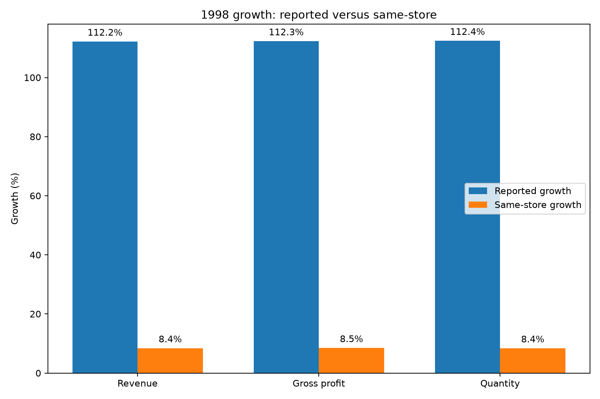
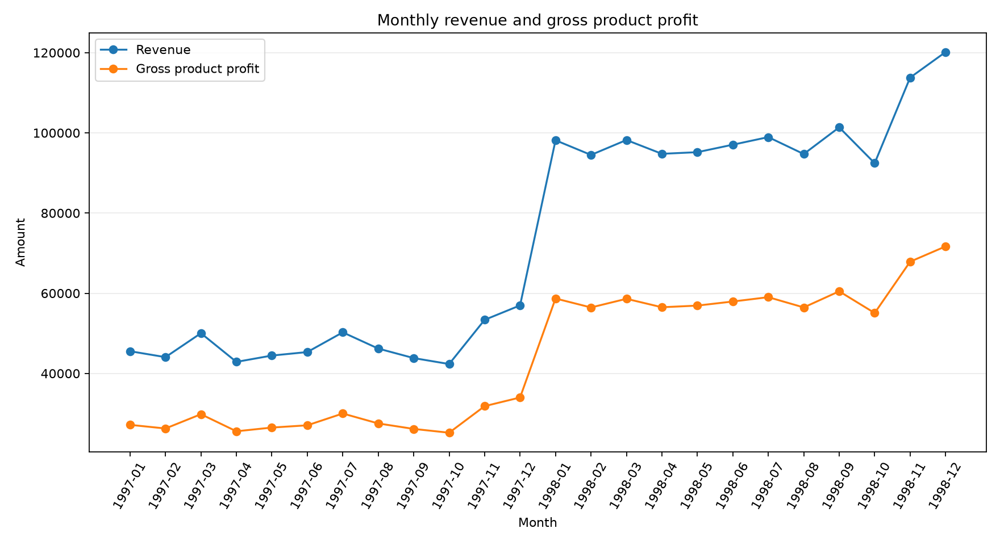
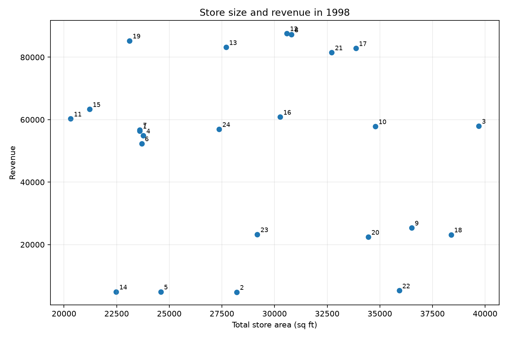
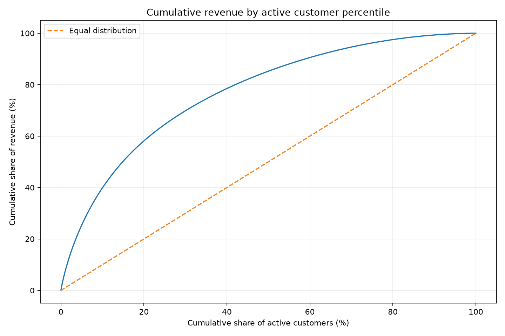
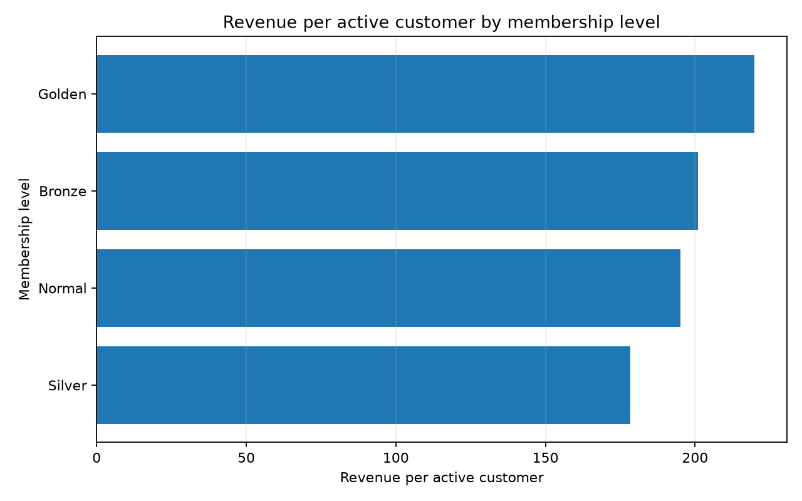
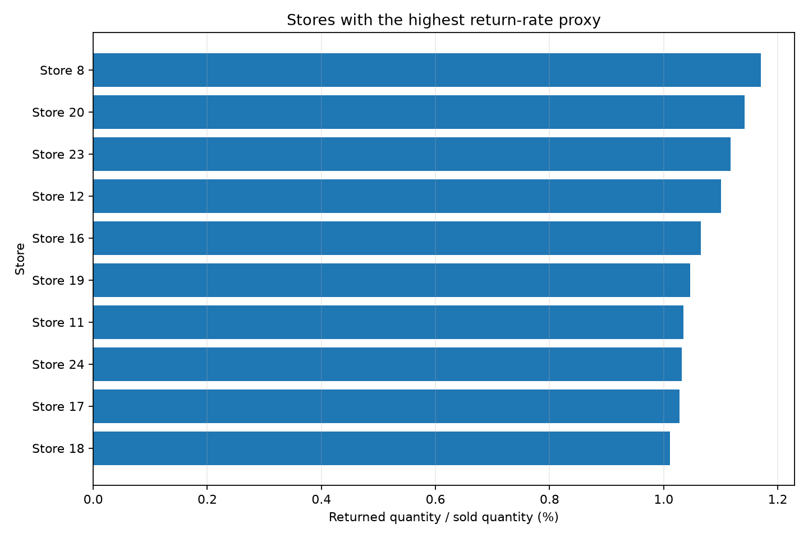

# Exploratory Data Analysis Summary

## Scope

This analysis uses the validated star-schema tables produced in the previous stage. Sales and returns are analysed separately because the return table does not contain a customer key or a transaction identifier that can be matched back to an individual sale.

## Headline metrics

| Metric | Result |
|---|---:|
| Revenue | $1,764,546.44 |
| Gross product profit | $1,052,818.78 |
| Gross margin | 59.67% |
| Quantity sold | 833,489 |
| Active customers | 8,842 |
| Active stores | 24 |
| Returned quantity | 8,289 |
| Return-rate proxy | 0.99% |

## Findings

### 1. Most of the reported 1998 growth came from store expansion

Reported revenue increased by **112.2%** in 1998, while revenue from the 13 stores active in both years increased by **8.4%**. The store count moved from **13** to **24**. The total growth figure is valid, but it should not be presented as organic growth.

### 2. Gross margin remained almost unchanged

Gross margin stayed close to **59.67%** across the period. Revenue and profit moved at nearly the same rate, which suggests that the improvement came mainly from higher sales volume and wider store coverage rather than a change in product margin.

### 3. The end of 1998 was the strongest part of the period

December 1998 generated **$120,160.84** in revenue, **20.2%** above the 1998 monthly average. November was also stronger than most earlier months. This pattern is useful for staffing and inventory planning, but the dataset contains only two years, so it is not enough to establish a long-term seasonal rule.

### 4. Store size was not a useful predictor of revenue

The correlation between total store area and 1998 revenue was **-0.10**. The relationship is weak and slightly negative. **Store 12** produced the highest 1998 revenue at **$87,623.61**, but several larger stores performed below it. Store format, location and local demand appear more useful than floor area alone.

### 5. Customer revenue is concentrated, but not dependent on a very small group

The top 10% of active customers generated **39.9%** of revenue, and the top 20% generated **58.1%**. This supports targeted retention work, while also showing that the wider customer base still contributes a material share.

### 6. Golden members had the highest revenue per active customer

Golden members averaged **$219.72** in revenue per active customer. Silver members were lowest at **$178.35**. Membership levels are associated with different customer value, but the data does not show programme costs, benefits or causal impact.

### 7. Returns were low overall but concentrated in a few products and stores

Returned quantity was **0.99%** of sold quantity overall. **Store 8** had the highest store-level proxy at **1.17%**. Among products with at least 300 units sold, **Shady Lake Spaghetti** had the highest proxy at **2.93%**.

The ratio is a monitoring proxy, not a matched return rate, because returns cannot be linked to the original sales transaction.

## Recommended dashboard emphasis

- Show reported growth and same-store growth together.
- Keep gross margin next to revenue and profit so expansion is not mistaken for better unit economics.
- Rank stores by both revenue and revenue per square foot.
- Add a customer concentration view and membership-level comparison.
- Use the return-rate proxy as an operational alert, with a visible methodology note.

## Analytical limits

- No order identifier is available, so order count and average order value cannot be calculated.
- Returns cannot be matched to a customer or sales line.
- Gross product profit excludes operating expenses and is not net profit.
- No discount, inventory, marketing campaign or sales-target data is available.
- Two years of history are not enough for robust forecasting or long-term seasonality claims.
